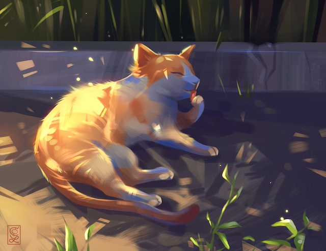
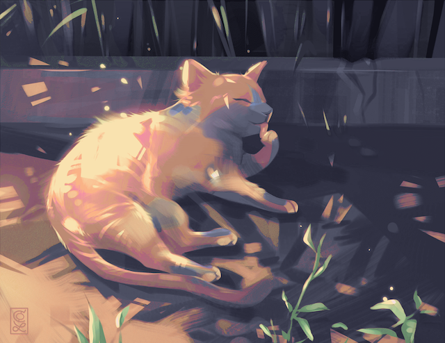

# Catppuccinify

 

A web application that re-colors any image using the [Catppuccin](https://github.com/catppuccin/catppuccin) color palette. Upload a PNG, JPEG, or WebP image, pick a flavor, and download the result — every pixel mapped to one of 26 hand-curated pastel tones.

## Inspiration

Catppuccin is a community-driven color scheme built around four "flavors" — Latte (light), Frappé (mid-tone), Macchiato (mid-dark), and Mocha (dark) — each defining the same 26 named colors at different luminance levels. The palette was designed for developer tooling (terminals, editors, syntax themes), but its warm, cohesive aesthetic works beautifully on photographs and artwork too.

Catppuccinify grew out of the desire to see what _any_ image looks like when its full color gamut is collapsed down to just those 26 tones. The challenge is doing so in a way that preserves the perceptual structure of the original — gradients should stay smooth, contrast should be retained, and the result should feel intentional rather than posterized. That goal drove every algorithm choice described below.

## How It Works

The conversion pipeline has two core components: **nearest-color matching** and **error-diffusion dithering**. Each one addresses a different part of the problem.

### Color Matching: CIEDE2000

The fundamental operation is: given an input pixel, which of the 26 palette colors is "closest"? The answer depends entirely on how you define distance between two colors.

**Why not Euclidean RGB distance?**
RGB is a device-oriented color space. Equal numeric steps do not correspond to equal perceived differences. A shift of (0, 20, 0) in the greens looks very different from a shift of (0, 0, 20) in the blues, even though the Euclidean distance is the same. Matching in RGB produces results where blues and purples are routinely confused, and skin tones map to the wrong hue entirely.

**Why not CIE76 (Lab Euclidean)?**
CIELAB was designed so that Euclidean distance in Lab space _would_ correlate with perceived difference. It is a massive improvement over RGB, but the correlation breaks down for saturated colors — exactly the colors that matter most when mapping to a vivid pastel palette.

**Why CIEDE2000?**
[CIEDE2000](https://en.wikipedia.org/wiki/Color_difference#CIEDE2000) (formally: CIE DE 2000, ISO/CIE 11664-6) is the most recent standard color-difference formula from the International Commission on Illumination. It applies five corrections on top of Lab distance:

1. **Lightness weighting (S_L)** — human vision is more sensitive to lightness differences in the mid-range.
2. **Chroma weighting (S_C)** — equal chroma steps look larger at low saturation.
3. **Hue weighting (S_H)** — perceptual hue uniformity varies by region (blues are especially non-uniform in Lab).
4. **Hue rotation term (R_T)** — corrects a known Lab problem where blue-purple differences are over-estimated.
5. **Chroma mean factor (G)** — stretches the a\* axis near the neutral axis to improve discrimination of near-greys.

The result is a distance metric that agrees closely with human judgment across the full gamut. For Catppuccinify, this means a brick-red pixel maps to `Red` or `Maroon` rather than `Flamingo`, and sky blue maps to `Sky` or `Sapphire` rather than `Lavender` — distinctions that simpler metrics get wrong.

**Performance optimization:** The CIEDE2000 formula requires Lab coordinates. Rather than converting each pixel to Lab and then converting each of the 26 palette colors to Lab on every comparison, all palette Lab values are precomputed at startup and stored alongside the RGB values. Pixel-side sRGB-to-linear conversion is done through a 256-entry lookup table, eliminating repeated `pow()` calls. The CIEDE2000 function itself is inlined to avoid redundant Lab conversions that a library call would perform.

### Dithering: Floyd-Steinberg Error Diffusion

Snapping each pixel independently to its nearest palette color produces _quantization banding_ — smooth gradients turn into flat, posterized blobs. Dithering solves this by distributing the quantization error of each pixel to its not-yet-processed neighbors, so that the _local average_ color stays close to the original even when individual pixels are constrained to the palette.

[Floyd-Steinberg](https://en.wikipedia.org/wiki/Floyd%E2%80%93Steinberg_dithering) (1976) is the most widely used error-diffusion kernel. After quantizing pixel (x, y), the RGB error is distributed to four neighbors:

```
            X       7/16
  3/16    5/16    1/16
```

where `X` is the current pixel. The weights sum to 1, so no error is lost. The scan proceeds left-to-right, top-to-bottom, so the three bottom neighbors and the right neighbor are always unprocessed.

**Why Floyd-Steinberg over ordered dithering?**
Ordered (Bayer matrix) dithering is faster — it requires no neighborhood state — but it produces visible grid-aligned patterns. Floyd-Steinberg's error diffusion creates a more organic, noise-like texture that looks natural at both screen resolution and when zoomed in. With only 26 target colors, the quality difference is dramatic.

**Why not a more advanced kernel (Jarvis-Judice-Ninke, Stucki, Sierra)?**
Larger kernels (e.g., Jarvis's 12-neighbor kernel) produce marginally smoother results but require buffering more scanlines and increase the per-pixel work. Floyd-Steinberg's 4-neighbor kernel strikes the right balance: visually excellent results with minimal memory overhead and straightforward implementation.

**Error diffusion in sRGB space:** The error distribution is performed in sRGB (gamma-encoded) space rather than linear light. While linear-space diffusion is theoretically more correct, sRGB-space diffusion is the established convention for Floyd-Steinberg and produces results that match user expectations — the dithering patterns are perceptually uniform, which is the property that actually matters for the visual output.

**Alpha channel handling:** Fully transparent pixels (alpha = 0) are preserved as-is and excluded from error diffusion. Semi-transparent pixels are quantized normally with their alpha value carried through unchanged. This ensures that images with transparency (PNGs with alpha) convert cleanly without fringing artifacts.

### Memory Management

The converter uses `sync.Pool` to reuse pixel buffers across conversions, avoiding repeated large allocations under concurrent load. The floating-point pixel buffer and alpha channel buffer are pooled separately and grown-on-demand, so a server handling a mix of image sizes settles into a steady allocation pattern quickly.

## Supported Flavors

| Flavor | Character | Base Color |
|---|---|---|
| **Latte** | Warm light theme | `#eff1f5` |
| **Frappe** | Muted mid-tone | `#303446` |
| **Macchiato** | Rich mid-dark | `#24273a` |
| **Mocha** | Deep dark theme | `#1e1e2e` |

Each flavor defines the same 26 color names (Rosewater, Flamingo, Pink, Mauve, Red, Maroon, Peach, Yellow, Green, Teal, Sky, Sapphire, Blue, Lavender, Text, Subtext1, Subtext0, Overlay2, Overlay1, Overlay0, Surface2, Surface1, Surface0, Base, Mantle, Crust) at different hue/saturation/lightness points. Mocha is selected by default.

## Architecture

```
static/index.html      Single-page frontend (vanilla HTML/CSS/JS)
    |
    | POST /api/convert   (multipart form: image + flavor)
    | GET  /api/status/:id (polling for progress)
    | GET  /api/download/:id
    v
internal/api/           HTTP handlers — upload validation, job creation
internal/job/           Job store (in-memory, sync.Map) + cleanup goroutine
internal/converter/     Palette definitions, CIEDE2000, Floyd-Steinberg
main.go                 Wiring, server lifecycle, graceful shutdown
```

- **No database.** Jobs live in a `sync.Map` and are cleaned up after 10 minutes. Temp files are written to an OS temp directory that is removed on shutdown.
- **No frontend framework.** The UI is a single HTML file with inline CSS and JS. Drag-and-drop upload, a flavor dropdown, a progress spinner, and side-by-side before/after display.
- **Async conversion.** Uploads return a job ID immediately. The client polls `/api/status/{job_id}` every 2 seconds. Progress is reported per-scanline.

## Getting Started

### Prerequisites

- Go 1.25+ (uses `b.Loop()` in benchmarks, range-over-int, and Go 1.22 routing patterns)

### Run

```sh
go run .
```

The server starts on `http://localhost:8080`.

### Build

```sh
go build -o catppuccinify .
./catppuccinify
```

### Test

```sh
go test ./...
```

### API

**Upload an image:**

```sh
curl -X POST http://localhost:8080/api/convert \
  -F "image=@photo.jpg" \
  -F "flavor=mocha"
# => {"job_id": "abc123..."}
```

**Check status:**

```sh
curl http://localhost:8080/api/status/abc123
# => {"job_id":"abc123","status":"processing","progress":"42"}
```

**Download result:**

```sh
curl -O http://localhost:8080/api/download/abc123
```

Valid flavor values: `latte`, `frappe`, `macchiato`, `mocha`. Omitting the flavor defaults to `mocha`.

## Supported Formats

| Format | Input | Output |
|---|---|---|
| PNG | Yes | Yes |
| JPEG | Yes | (converted to PNG) |
| WebP | Yes | (converted to PNG) |

Maximum upload size: 10 MB. Output is always PNG to preserve the exact palette colors without lossy re-compression.

## Dependencies

| Package | Purpose |
|---|---|
| [go-colorful](https://github.com/lucasb-eyer/go-colorful) | sRGB/Lab color space conversions, hex parsing |
| [x/image](https://pkg.go.dev/golang.org/x/image) | WebP decoding support |

## License

See [LICENSE](LICENSE) for details.
